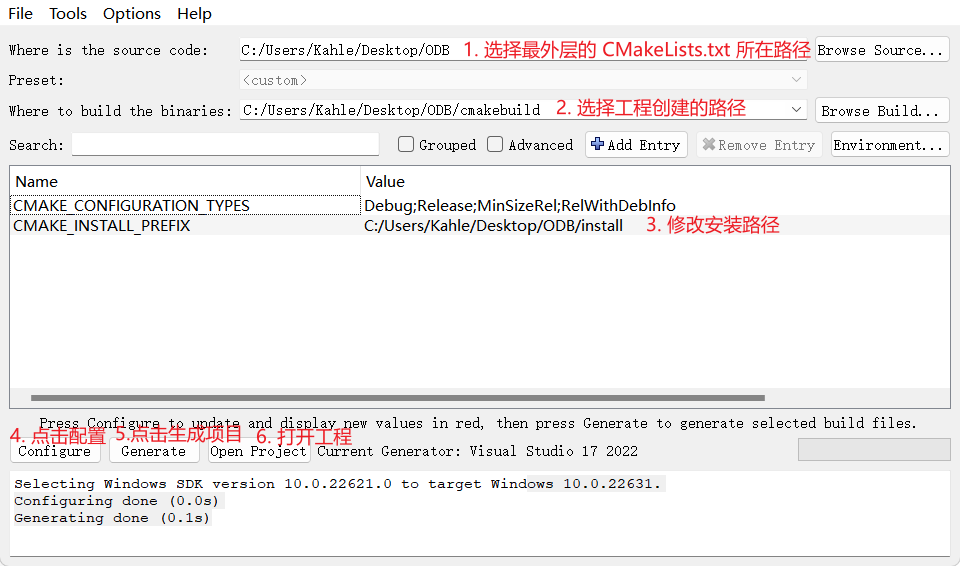
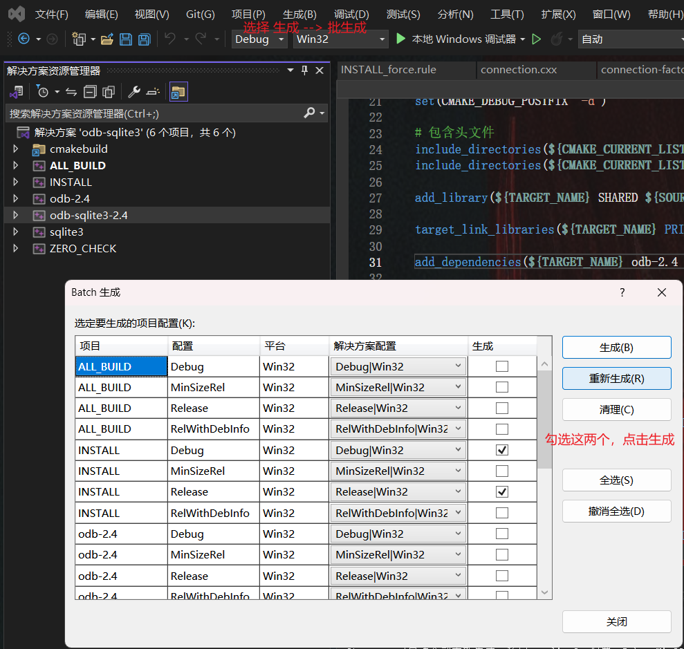

## 0. 前言
本示例已上传开源仓库：[odb-sqlite3-win](https://github.com/Aixii/odb-sqlite3-win)
## 1. 下载需要的资源

A. libodb-2.4.0
简述：用来生成 odb 动态库或静态库
下载链接：[官网点击下载](https://codesynthesis.com/download/odb/2.4/libodb-2.4.0.zip)

B. libodb-sqlite-2.4.0
简述：用来生成支持 sqlite 的 odb 动态库
下载链接：[官网点击下载](https://codesynthesis.com/download/odb/2.4/libodb-sqlite-2.4.0.zip)

C. sqlite-amalgamation-3470200
简述：sqlite 3.47.2 源码
下载链接：[官网点击下载](https://www.sqlite.org/2024/sqlite-amalgamation-3470200.zip)

D. odb-2.4.0-i686-windows
简述：odb 的依赖的环境
下载链接：[官网点击下载](https://codesynthesis.com/download/odb/2.4/odb-2.4.0-i686-windows.zip)
## 2. 编写 CMakeLists.txt

将以上资源解压后放到一个文件夹下, 这些文件夹下保留这些即可，需要将 libodb-2.4.0/odb 下的内容全部拷贝到 libodb-sqlite-2.4.0/odb 下。

```
├─libodb-2.4.0
│  ├─odb
│  └─CMakeLists.txt
├─libodb-sqlite-2.4.0
│  ├─odb
│  └─CMakeLists.txt
├─odb-2.4.0-i686-windows
│  ├─bin
│  ├─etc
│  ├─man
│  └─mingw
├─sqlite-amalgamation-3470200
│  ├─sqlite3.c
│  ├─sqlite3.h
│  └─CMakeLists.txt
└-CMakeLists.txt
```

### A. 最外层 CMakeLists.txt
```cmake
cmake_minimum_required(VERSION 3.10)

project(odb-sqlite3 VERSION 1.0 LANGUAGES CXX)

# 设置 C++ 标准
set(CMAKE_CXX_STANDARD 11)
set(CMAKE_CXX_STANDARD_REQUIRED True)

if(CMAKE_SIZEOF_VOID_P EQUAL 4) 
	set(CMAKE_INSTALL_PREFIX ${CMAKE_INSTALL_PREFIX}/odb-x86)
elseif(CMAKE_SIZEOF_VOID_P EQUAL 8) 
	set(CMAKE_INSTALL_PREFIX ${CMAKE_INSTALL_PREFIX}/odb-x64)
endif()

# 包含子目录
add_subdirectory(libodb-2.4.0)
add_subdirectory(sqlite-amalgamation-3470200)
add_subdirectory(libodb-sqlite-2.4.0)

# 配置安装路径
install(DIRECTORY odb-2.4.0-i686-windows/bin DESTINATION ${CMAKE_INSTALL_PREFIX})
install(DIRECTORY odb-2.4.0-i686-windows/etc DESTINATION ${CMAKE_INSTALL_PREFIX})
install(DIRECTORY odb-2.4.0-i686-windows/man DESTINATION ${CMAKE_INSTALL_PREFIX})
install(DIRECTORY odb-2.4.0-i686-windows/mingw DESTINATION ${CMAKE_INSTALL_PREFIX})
```
### B. libodb-2.4.0 下的 CMakeLists.txt
```cmake
set(TARGET_NAME odb-2.4)

# 查找所有源文件
file(GLOB  SOURCES 
${CMAKE_CURRENT_LIST_DIR}/odb/*.cxx
${CMAKE_CURRENT_LIST_DIR}/odb/details/*.cxx
${CMAKE_CURRENT_LIST_DIR}/odb/details/meta/*.cxx
${CMAKE_CURRENT_LIST_DIR}/odb/details/shared-ptr/*.cxx
${CMAKE_CURRENT_LIST_DIR}/odb/details/win32/*.cxx
${CMAKE_CURRENT_LIST_DIR}/odb/tr1/*.cxx
)

file(GLOB HEADERS 
${CMAKE_CURRENT_LIST_DIR}/odb/*.hxx 
${CMAKE_CURRENT_LIST_DIR}/odb/*.txx
${CMAKE_CURRENT_LIST_DIR}/odb/details/*.txx
${CMAKE_CURRENT_LIST_DIR}/odb/details/*.hxx
${CMAKE_CURRENT_LIST_DIR}/odb/details/*.
${CMAKE_CURRENT_LIST_DIR}/odb/details/meta/*.txx
${CMAKE_CURRENT_LIST_DIR}/odb/details/meta/*.hxx
${CMAKE_CURRENT_LIST_DIR}/odb/details/shared-ptr/*.txx
${CMAKE_CURRENT_LIST_DIR}/odb/details/shared-ptr/*.hxx
${CMAKE_CURRENT_LIST_DIR}/odb/details/win32/*.txx
${CMAKE_CURRENT_LIST_DIR}/odb/details/win32/*.hxx
${CMAKE_CURRENT_LIST_DIR}/odb/tr1/*.txx
${CMAKE_CURRENT_LIST_DIR}/odb/tr1/*.hxx
${CMAKE_CURRENT_LIST_DIR}/odb/compilers/vc/*.hxx
)

# 添加宏定义
add_definitions(-DLIBODB_DYNAMIC_LIB)
add_definitions(-wd4275)
add_definitions(-wd4290)

set(CMAKE_DEBUG_POSTFIX "-d")

# 包含头文件
include_directories(${CMAKE_CURRENT_LIST_DIR})

add_library(${TARGET_NAME} SHARED ${SOURCES} ${HEADERS})

install(TARGETS ${TARGET_NAME} 
RUNTIME DESTINATION runtime
ARCHIVE DESTINATION lib)

file(GLOB INSTALL_INCLUDE_FILES 
odb/*.hxx 
odb/*.txx 
odb/*.ixx)
install(FILES ${INSTALL_INCLUDE_FILES}	DESTINATION ${CMAKE_INSTALL_PREFIX}/include/odb)

file(GLOB INSTALL_INCLUDE_FILES 
odb/details/*.hxx 
odb/details/*.txx 
odb/details/*.ixx
odb/details/*.h)
install(FILES ${INSTALL_INCLUDE_FILES}	DESTINATION ${CMAKE_INSTALL_PREFIX}/include/odb/details)

file(GLOB INSTALL_INCLUDE_FILES 
odb/details/meta/*.hxx 
odb/details/meta/*.txx 
odb/details/meta/*.ixx)
install(FILES ${INSTALL_INCLUDE_FILES}	DESTINATION ${CMAKE_INSTALL_PREFIX}/include/odb/details/meta)

file(GLOB INSTALL_INCLUDE_FILES 
odb/details/shared-ptr/*.hxx 
odb/details/shared-ptr/*.txx 
odb/details/shared-ptr/*.ixx)
install(FILES ${INSTALL_INCLUDE_FILES}	DESTINATION ${CMAKE_INSTALL_PREFIX}/include/odb/details/shared-ptr)

file(GLOB INSTALL_INCLUDE_FILES 
odb/details/win32/*.hxx 
odb/details/win32/*.txx 
odb/details/win32/*.ixx)
install(FILES ${INSTALL_INCLUDE_FILES}	DESTINATION ${CMAKE_INSTALL_PREFIX}/include/odb/details/win32)

file(GLOB INSTALL_INCLUDE_FILES 
odb/tr1/*.hxx 
odb/tr1/*.txx 
odb/tr1/*.ixx)
install(FILES ${INSTALL_INCLUDE_FILES}	DESTINATION ${CMAKE_INSTALL_PREFIX}/include/odb/tr1)

file(GLOB INSTALL_INCLUDE_FILES odb/compilers/vc/*.hxx)
install(FILES ${INSTALL_INCLUDE_FILES}	DESTINATION ${CMAKE_INSTALL_PREFIX}/include/odb/compilers/vc)
```
### C. sqlite-amalgamation-3470200 下的 CMakeLists.txt
```cmake
set(CMAKE_WINDOWS_EXPORT_ALL_SYMBOLS ON)

set(TARGET_NAME sqlite3)

project(${TARGET_NAME} C)

add_definitions(-DSQLITE_ENABLE_UNLOCK_NOTIFY)

# 查找所有源文件
file(GLOB  SOURCES 
${CMAKE_CURRENT_LIST_DIR}/*.c)

file(GLOB HEADERS 
${CMAKE_CURRENT_LIST_DIR}/*.h 
)

set(CMAKE_DEBUG_POSTFIX "-d")

add_library(${TARGET_NAME} SHARED ${SOURCES} ${HEADERS})

install(TARGETS ${TARGET_NAME} 
RUNTIME DESTINATION runtime
ARCHIVE DESTINATION lib)
install(FILES sqlite3.h
        DESTINATION ${CMAKE_INSTALL_PREFIX}/include)

```
### D. libodb-sqlite-2.4.0 下的 CMakeLists.txt
```cmake
set(TARGET_NAME odb-sqlite3-2.4)

# 查找所有源文件
file(GLOB  SOURCES 
${CMAKE_CURRENT_LIST_DIR}/odb/sqlite/*.cxx
${CMAKE_CURRENT_LIST_DIR}/odb/sqlite/details/*.cxx
)

file(GLOB HEADERS 
${CMAKE_CURRENT_LIST_DIR}/odb/sqlite/*.hxx 
${CMAKE_CURRENT_LIST_DIR}/odb/sqlite/details/*.txx
)

# 添加宏定义
add_definitions(-DLIBODB_SQLITE_DYNAMIC_LIB)
add_definitions(-DLIBODB_SQLITE_HAVE_UNLOCK_NOTIFY)
add_definitions(-wd4275)
add_definitions(-wd4273)
add_definitions(-wd4290)

set(CMAKE_DEBUG_POSTFIX "-d")

# 包含头文件
include_directories(${CMAKE_CURRENT_LIST_DIR})
include_directories(${CMAKE_CURRENT_LIST_DIR}/../sqlite-amalgamation-3470200)

add_library(${TARGET_NAME} SHARED ${SOURCES} ${HEADERS})

target_link_libraries(${TARGET_NAME} PRIVATE odb-2.4 sqlite3)

add_dependencies(${TARGET_NAME} odb-2.4 sqlite3)

install(TARGETS ${TARGET_NAME} 
RUNTIME DESTINATION runtime
ARCHIVE DESTINATION lib)

file(GLOB INSTALL_INCLUDE_FILES 
odb/sqlite/*.hxx 
odb/sqlite/*.txx 
odb/sqlite/*.ixx)
install(FILES ${INSTALL_INCLUDE_FILES}	DESTINATION ${CMAKE_INSTALL_PREFIX}/include/odb/sqlite)

file(GLOB INSTALL_INCLUDE_FILES 
odb/sqlite/details/*.hxx
odb/sqlite/details/*.txx
odb/sqlite/details/*.ixx
)
install(FILES ${INSTALL_INCLUDE_FILES}	DESTINATION ${CMAKE_INSTALL_PREFIX}/include/odb/sqlite/details)
```

## 3. cmake-gui 配置生成 visual studio 工程

以 VS2022 为例，打开 cmake-gui 做以下操作， 在第一次点击 Configure 时，选择自己要创建的目标架构是 x86 就选 win32; 是 x64 就选 x64。



## 4. 编译工程


## 5. 使用 odb
```
└─odb-x86
    ├─bin
    ├─etc
    ├─include
    │  └─odb
    │      ├─compilers
    │      │  └─vc
    │      ├─details
    │      │  ├─meta
    │      │  ├─shared-ptr
    │      │  └─win32
    │      └─tr1
    ├─lib
    ├─man
    ├─mingw
    └─runtime
```

介绍一下，使用 odb 的项目需要使用 odb.exe 对编辑的文件先进行一次解释，生成 hxx 和 cxx 文件参与编译。

这里可以下载 odb 示例进行参考：[odb-examples-2.4.0.zip](https://codesynthesis.com/download/odb/2.4/odb-examples-2.4.0.zip)

创建一个文件夹 test。  
将示例中 relationship 示例下的 employee.hxx 拷贝到这个文件夹中。  
在文件夹中创建一个 main.cpp 和 CMakeLists.txt。  
将示例 relationship 中的 driver.cxx 内容全部拷贝到 main.cpp 中。  

### A. main.cpp
main.cpp 中修改了几个地方，修改的目的是在代码中创建数据库。  
1. 注释掉 `#include "database.hxx"`
2. 修改 main 函数中 `create_database` 处的代码为：
```cxx
std::auto_ptr<database> db(new odb::sqlite::database("hello.db", SQLITE_OPEN_READWRITE | SQLITE_OPEN_CREATE));
{
	// 开始事务
	odb::transaction t(db->begin());
	// 创建表
	odb::schema_catalog::create_schema(*db.get());
	// 提交事务
	t.commit();
}
```
3. 在代码末尾添加 `system("pause");` 否则黑窗口一闪而过，在最后异常处理 return 前也添加上。

### B. CMakeLists.txt
CMakeLists.txt 的内容：
```cmake

set(CMAKE_VERBOSE_MAKEFILE ON)

cmake_minimum_required(VERSION 3.10)

# 项目名称和版本
project(odbtest VERSION 1.0 LANGUAGES CXX)

# 设置 C++ 标准
set(CMAKE_CXX_STANDARD 11)
set(CMAKE_CXX_STANDARD_REQUIRED TRUE)

# odb 路径
if(CMAKE_SIZEOF_VOID_P EQUAL 4) 
	set(ODB_PATH 3rdparty/odb-x86)
elseif(CMAKE_SIZEOF_VOID_P EQUAL 8) 
	set(ODB_PATH 3rdparty/odb-x64)
endif()

# ODB 编译器执行路径
file(GLOB ODB_EXEC ${ODB_PATH}/bin/odb.exe)

include_directories(${ODB_PATH}/include)

option(BUILD_DEBUG "构建Debug版本" ON)

if(BUILD_DEBUG)
    set(CMAKE_BUILD_TYPE "Debug")
    add_definitions(-D_DEBUG)
else()
    set(CMAKE_BUILD_TYPE "Release")
    add_definitions(-D_NODEBUG)
endif()

set(ODB_COMMAND_PARAMETER 
--generate-query 
--generate-session 
--generate-schema 
--generate-prepared 
-d sqlite 
--default-pointer std::tr1::shared_ptr)

# 生成 ODB 代码的源文件
add_custom_command(
    OUTPUT ${PROJECT_SOURCE_DIR}/employee-odb.hxx ${PROJECT_SOURCE_DIR}/employee-odb.ixx ${PROJECT_SOURCE_DIR}/employee-odb.cxx
	WORKING_DIRECTORY ${PROJECT_SOURCE_DIR}
    COMMAND ${ODB_EXEC} ${ODB_COMMAND_PARAMETER} employee.hxx 
    DEPENDS employee.hxx
    COMMENT "generate employee-odb"
)

# 定义一个目标来依赖上面的自定义命令
add_custom_target(odb_target
    DEPENDS employee-odb.ixx employee-odb.hxx employee-odb.cxx
)

# 添加源文件
file(GLOB SOURCES "*.cpp")
file(GLOB HEADER "*.h")
file(GLOB HEADER_HXX "*.hxx")
file(GLOB SOURCES_CXX "*.cxx")

add_definitions(-D_CRT_SECURE_NO_DEPRECATE)
add_definitions(-DDATABASE_SQLITE)
add_definitions(-wd4275)
add_definitions(-D_SILENCE_TR1_NAMESPACE_DEPRECATION_WARNING)

link_directories(${ODB_PATH}/lib)

# 生成可执行文件
add_executable(${PROJECT_NAME} ${SOURCES} ${HEADER} ${HEADER_HXX} ${SOURCES_CXX} employee-odb.cxx)

# 确保 odb_target 在编译之前被执行
add_dependencies(${PROJECT_NAME} odb_target)


if(CMAKE_BUILD_TYPE MATCHES Debug)
    set(LIBRARY_SUFFIX "-d")
else()
    set(LIBRARY_SUFFIX "")
endif()

# 假设有一个第三方库在 lib/ 目录下
target_link_libraries(${PROJECT_NAME} PRIVATE odb-2.4${LIBRARY_SUFFIX} odb-sqlite3-2.4${LIBRARY_SUFFIX})

# 安装
unset(CMAKE_INSTALL_PREFIX CACHE)
set(CMAKE_INSTALL_PREFIX "${CMAKE_SOURCE_DIR}/bin" CACHE STRING "")

message(STATUS ${CMAKE_INSTALL_PREFIX})

install(TARGETS ${PROJECT_NAME} DESTINATION ${CMAKE_INSTALL_PREFIX})

install(FILES 
${ODB_PATH}/runtime/odb-2.4${LIBRARY_SUFFIX}.dll  
${ODB_PATH}/runtime/odb-sqlite3-2.4${LIBRARY_SUFFIX}.dll 
${ODB_PATH}/runtime/sqlite3${LIBRARY_SUFFIX}.dll 
DESTINATION ${CMAKE_INSTALL_PREFIX})
```
### C. 编译与运行

1. 用 cmake-gui 生成 vs 工程，默认即可（选择自己的目标平台 x86 或 x64）。
2. vs 打开工程生成 INSTALL 目标